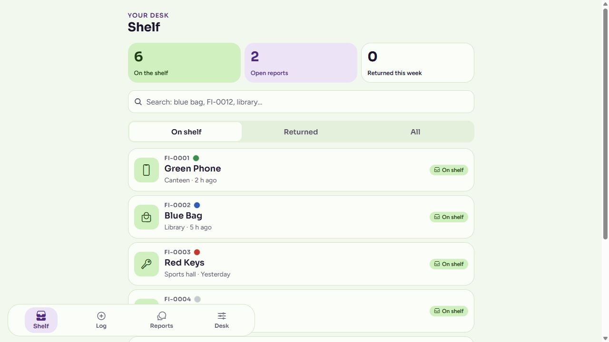

# Reunio

**Lost property, from the front desk back to its owner.**

A React Native and Expo app by **Salem Elatrash** for college and venue front desks. Log found items, review matches to lost reports and record a checked handover.

[Try the demo](https://slooma951.github.io/reunio-demo/) · [Read the project case study](https://slooma951.github.io/portfolio/case-studies/reunio.html) · [Explore my portfolio](https://slooma951.github.io/portfolio/)

## Project evidence: start here

| Inspect | What you can review |
| --- | --- |
| [Selected TypeScript code](examples/filter.ts) | Apply item status first, accept an exact or partial reference query, then require every significant search word to occur within the same item record. |
| [Output](evidence/demo-output.json) | A runnable example and its saved JSON result, using synthetic data. |
| [Methodology and testing results](evidence/README.md) | **8 public-example tests pass**, checked 4 October 2026; provenance, commands and limits included. |

*App screenshot with sample items. Counts are demo records, not adoption or usage figures. No real owner information is shown.*

## The problem

Someone hands in a phone or a bag while its owner asks at another desk. Paper notes and scattered messages make it difficult to connect the two. Reunio gives staff one place to record an item and review what an owner remembers.

## Why this matters now

Nearly 19,000 items reached Dublin Airport lost property in 2024; 56% were returned to their owners. That leaves about 44%, over 8,000 items, not returned. The latter figures are approximate calculations from the reported totals. [daa, reported by The Irish Post, December 2024](https://www.irishpost.com/news/hundreds-of-wedding-and-engagement-rings-found-in-airports-lost-property-283322).

Transport for London receives about 6,000 lost items each week, and fewer than one in five is reclaimed. After three months, unclaimed items go to charity or auction. [TfL figures reported by Eastern Eye](https://www.easterneye.biz/transport-for-london-lost-property/). [TfL, lost-property disposal](https://tfl.gov.uk/corporate/transparency/freedom-of-information/foi-request-detail?referenceId=FOI-2488-2425).

Dublin Bus, Irish Rail and Luas keep lost property for a maximum of 30 days. [Transport for Ireland](https://www.transportforireland.ie/support/lost-property/). [Transport for Ireland, holding period](https://www.transportforireland.ie/support/lost-property-information/).

In May 2026, a Dublin college student hub told students it held over 100 items, all recorded on a spreadsheet. Source: the student hub's email to students, supplied by the project author. The college and private email are not published here.

The problem Reunio addresses is often a missed connection: an item is already there, but its owner asks at the wrong desk or on the wrong day. A notebook or spreadsheet holds the record, and the holding period can end before the owner finds it.

Reunio gives each found item a tag number and a record in about 20 seconds; a photo can help fill in what it is. Lost reports are matched against the shelf with reasons shown. Staff check ownership before a return, and the desk can track items logged, items returned and time to return.

No desk has used Reunio yet, so it has no measured return rate. A free pilot is how that would be measured. There is no evidence yet that Reunio raises return rates.

## The workflow

1. **Log:** capture the item’s kind, colour, place and useful details, then attach its reference.
2. **Match:** review lost reports against found records, with explanations for suggested matches.
3. **Return:** staff check ownership and record the handover. A suggestion does not release an item automatically.

## What I built

- A searchable shelf with filters and item histories.
- Found-item logging and lost-report screens.
- Match explanations and a guided return flow.
- Desk settings, retention controls and export tools.
- A web preview with on-device image suggestions for logging, backed by manual entry.

**Technologies:** React Native, Expo, TypeScript, local storage and on-device image processing in the web preview.

## Engineering choices

Quick logging reduces the work required to capture an item. Explanations help staff assess a match instead of relying on an unexplained score. Ownership checks stay with staff. Local records and retention controls are part of the prototype’s data handling.

AI coding assistance was used during development. No proprietary matching rules, model configuration or implementation source are published here.

## Current stage and limits

Reunio is a working prototype. The web preview was built and its sample-data shelf inspected on **4 October 2026** for this showcase. That is a presentation check, not a complete product audit.

No live front-desk pilot has taken place. Real-world reliability, shared-desk operation and deployment still need evaluation. Screenshots use example data; no user numbers or success rates are claimed.

## Intended benefit

Losing keys, a phone or a bag can interrupt a student’s day. Clear records and a checked return process can make it easier for staff to help, without treating a suggested match as proof of ownership.

## Repository scope

This portfolio snapshot contains selected source code, tests, evidence, an explanation and a sample-data screenshot. Product source, owner records, credentials and implementation history remain private. No licence to the private implementation is granted here.

For a project walkthrough, [connect on LinkedIn](https://www.linkedin.com/in/salem-elatrash/).

This public showcase is archived as a portfolio snapshot with selected code and reproducible evidence. Archiving applies to this presentation repository; product development is maintained separately in private.
