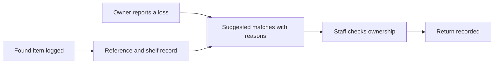

# Reunio

**Lost property, from the front desk back to its owner.**

A React Native and Expo app by **Salem Elatrash** for college and venue front desks. Log found items, review matches to lost reports and record a checked handover.

[Read the project case study](https://slooma951.github.io/portfolio/case-studies/reunio.html) · [Explore my portfolio](https://slooma951.github.io/portfolio/)

*App screenshot with sample items. Counts are demo records, not adoption or usage figures. No real owner information is shown.*

## The problem

Someone hands in a phone or a bag while its owner asks at another desk. Paper notes and scattered messages make it difficult to connect the two. Reunio gives staff one place to record an item and review what an owner remembers.

## The workflow

1. **Log:** capture the item’s kind, colour, place and useful details, then attach its reference.
2. **Match:** review lost reports against found records, with explanations for suggested matches.
3. **Return:** staff check ownership and record the handover. A suggestion does not release an item automatically.

## What I built

- A searchable shelf with filters and item histories.
- Found-item logging and lost-report screens.
- Match explanations and a guided return flow.
- Desk settings, retention controls and export tools.
- A web preview with on-device image suggestions for logging, backed by manual entry.

**Technologies:** React Native, Expo, TypeScript, local storage and on-device image processing in the web preview.

## Engineering choices

Quick logging reduces the work required to capture an item. Explanations help staff assess a match instead of relying on an unexplained score. Ownership checks stay with staff. Local records and retention controls are part of the prototype’s data handling.

AI coding assistance was used during development. No proprietary matching rules, model configuration or implementation source are published here.

## Current stage and limits

Reunio is a working prototype. The web preview was built and its sample-data shelf inspected on **4 October 2026** for this showcase. That is a presentation check, not a complete product audit.

No live front-desk pilot has taken place. Real-world reliability, shared-desk operation and deployment still need evaluation. Screenshots use example data; no user numbers or success rates are claimed.

## Intended benefit

Losing keys, a phone or a bag can interrupt a student’s day. Clear records and a checked return process can make it easier for staff to help, without treating a suggested match as proof of ownership.

## Repository scope

This is a documentation-only portfolio snapshot. It contains the explanation and a sample-data screenshot. Product source, owner records, credentials and implementation history remain private. No licence to the private implementation is granted here.

For a project walkthrough, [connect on LinkedIn](https://www.linkedin.com/in/salem-elatrash/).

This public showcase is archived as a portfolio snapshot. Archiving applies to this presentation repository; product development is maintained separately in private.
